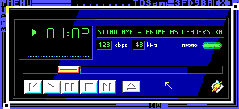

# ZealAmp

MP3 player for ZealOS

# Requirements

- AC97 sound card

# Usage

1. Add a `Music` folder
2. `#include "Run";`
3. Select Music and press Esc

# TODO

- ID3v2 support

- Playlists and related settings (shuffle/random)

- Visualizers

- Support for .wsz Skin Packs

# Disclaimer

This is a port of Alec Murphy's TOSAmp for ZealOS.